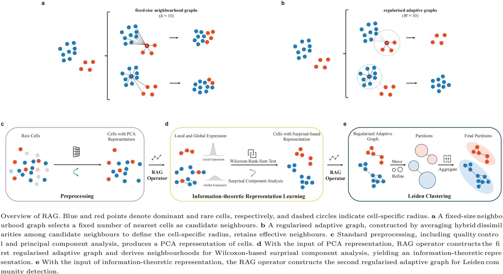

# RAG - rare cell identification tool from single-cell RNA sequencing data in Python (名字-功能介绍)

## Introduction
（三句话：RAG算法流程，主要特点，输入输出）
RAG is a regularised adaptive graph-based tool for rare-cell identification from single-cell RNA-seq data.
It first preprocesses and denoises data via PCA, learns an information-theoretic representation using the first regularised adaptive graph, and performs Leiden clustering with the second adaptive graph to obtain robust rare-cell clusters.
Its core module, the RAG operator, constructs regularised adaptive graphs by combining Euclidean/cosine candidate-neighbour construction, cell-specific radius-based adjacency control, and locally scaled hybrid affinity assignment.
It supports standard scRNA-seq expression matrices and AnnData objects as input, outputs cell cluster labels, rare-cell lists and visualisation results, and is compatible with multi-sample and batch-corrected data for large-scale and highly imbalanced single-cell analyses.



## Installation

Create a clean Python environment and install the dependencies:

```bash
conda create -n rag python=3.12
conda activate rag
pip install -r requirements.txt
```

## Usage
```bash
python3 RAG.py --dataset <dataset>
```

Main Parameters (这些都是用户可以自己设置的嘛？不是的话，要不就不写了？如果是的话，需要在Usage部分写详细的用法）
- `tau_PCA`: cumulative explained-variance threshold for PCA, default `0.9`.
- `rho_M`: candidate-neighbour ratio, default `0.005`.
- `M_min`: lower bound of the candidate-neighbour count, default `5`.
- `alpha`: Euclidean/cosine hybrid dissimilarity weight, default `0.5`.
- `eta`: radius bias-correction constant, default `1.0`.
- `gamma`: Leiden resolution parameter, default `1.0`.

## Demo
### Dataset
There are two datasets are included:

```text
demo/data/Deng.h5
demo/data/Airway.h5
```
Each HDF5 file follows the same layout:

- `expression_data`: cell-by-gene count matrix
- `cell_id`: cell identifiers
- `cell_type`: reference cell-type labels
- `gene_names`: gene names

### Run RAG on a dataset:

```bash
python3 RAG.py --dataset deng
python3 RAG.py --dataset airway
```
这里不加参数默认就跑两个，有点神奇了。
默认是跑demo/data目录下的所有h5文件嘛？
可以改成，跑指定文件不？而且需要输入全部路径，比如：
python3 RAG.py --dataset /demo/data/Deng.h5


### Outputs

The demo workflow includes data loading, quality control, normalisation, log transformation, highly variable gene selection, PCA, RAG graph construction, Wilcoxon-based representation learning, Leiden clustering, and rare-cell evaluation.
Results are written to `demo/results/`. The main output files include:

```text
demo/results/Deng_h5/cluster_assignments.csv
demo/results/Airway_h5/cluster_assignments.csv
demo/results/*/summary_eval.txt
demo/results/demo_summary_rare.csv
demo/results/*/rare_diagnostics_*_RAG.csv
demo/results/*/all_clusters_diagnostics_*_RAG.csv
```

The evaluation outputs report precision, F1 score, and rare-type coverage rate (RCR / `RareTypeCoverage`).

## Repository Contents

- `RAG.py`: entry point for running the demo datasets.
- `graphConstruct.py`: implementation of the RAG graph-construction operator.
- `leiden_clustering.py`: Leiden clustering on the RAG-constructed graph.
- `utils/preprocess.py`: data loading, quality control, normalisation, log transformation, highly variable gene selection, and PCA.
- `eval/`: rare-cell evaluation utilities.
- `demo/`: bundled demo datasets and output directory.

## Lcience

This project is covered under the GPL-3.0 License. 这个是最宽松的证书，改个别的也好

## Contact
If any questions, please do not hesitate to contact us at:

Xingsu Wang, wangxingsu@gdiist.cn

