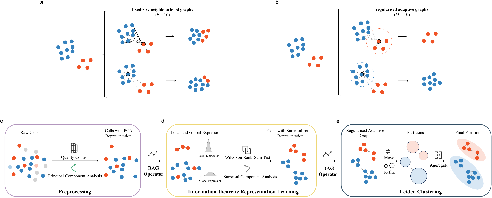

# RAG - Rare-cell identification from single-cell RNA-seq data in Python

## Introduction

RAG is a regularised adaptive graph-based method implemented in Python for rare-cell identification from single-cell RNA-seq data.

RAG follows a three-stage workflow: preprocessing, information-theoretic representation learning, and clustering. It first performs standard scRNA-seq quality control, normalisation, log transformation, highly variable gene selection, and PCA. It then uses the first regularised adaptive graph to define neighbourhoods for Wilcoxon-based surprisal component analysis, and finally constructs a second regularised adaptive graph for Leiden clustering.

The core module is the RAG operator, which constructs regularised adaptive graphs by combining Euclidean/cosine candidate-neighbour construction, cell-specific radius-based adjacency control, and locally scaled hybrid affinity assignment.

This repository provides a demo workflow for bundled scRNA-seq HDF5 datasets. The implementation uses Scanpy AnnData internally and outputs cell cluster assignments, rare-cluster evaluation summaries, and diagnostic tables.



**Overview of RAG.** Blue and red points denote dominant and rare cells, respectively, and dashed circles indicate cell-specific radius. **a** A fixed-size neighbourhood graph selects a fixed number of nearest cells as candidate neighbours. **b** A regularised adaptive graph, constructed by averaging hybrid dissimilarities among candidate neighbours to define the cell-specific radius, retains effective neighbours. **c** Standard preprocessing, including quality control and principal component analysis, produces a PCA representation of cells. **d** With the input of PCA representation, RAG operator constructs the first regularised adaptive graph and derives neighbourhoods for Wilcoxon-based surprisal component analysis, yielding an information-theoretic representation. **e** With the input of information-theoretic representation, the RAG operator constructs the second regularised adaptive graph for Leiden community detection.

## Installation

Create a clean Python environment and install the dependencies:

```bash
conda create -n rag python=3.12
conda activate rag
pip install -r requirements.txt
```

## Usage

Run RAG from the repository root:

```bash
python RAG.py --dataset deng
python RAG.py --dataset airway
```

The bundled demo datasets are:

```
demo/data/Deng.h5
demo/data/Airway.h5
```

Each HDF5 file follows the same layout:

- `expression_data`: cell-by-gene count matrix
- `cell_id`: cell identifiers
- `cell_type`: reference cell-type labels
- `gene_names`: gene names

## Outputs

Results are written to `demo/results/`.

Main output files include:

```
demo/results/*/cluster_assignments.csv
demo/results/*/*_clustered.h5ad
demo/results/*/summary_eval.txt
demo/results/demo_summary_rare.csv
demo/results/*/rare_diagnostics_*_RAG.csv
demo/results/*/all_clusters_diagnostics_*_RAG.csv
```

The evaluation outputs report:

- Precision
- F1 score
- Rare-type coverage rate, also reported as `RCR`

The diagnostic files can be used to inspect rare-cell recovery, cluster composition, and candidate rare clusters.

## Airway case study

An optional Airway case-study workflow is provided in `case_studies/airway/`. It runs Airway RAG clustering, performs differential expression, computes RPS marker-uniqueness ranking, and generates the Airway UMAP plus top-marker panel used for downstream interpretation.

```powershell
cd case_studies/airway
.\run_airway_all.ps1
```

## Repository contents

- `RAG.py`: entry point for running RAG on demo datasets.
- `graphConstruct.py`: implementation of the RAG graph-construction operator.
- `leiden_clustering.py`: Leiden clustering on the graph constructed by the RAG operator.
- `utils/preprocess.py`: data loading, quality control, normalisation, log transformation, and highly variable gene selection.
- `utils/aPCA.py`: PCA dimensionality reduction.
- `eval/`: rare-cell evaluation utilities.
- `demo/`: bundled demo datasets and output directory.
- `case_studies/airway/`: optional Airway case-study workflow.

## Contact

For questions, please contact:

Xingsu Wang  
wangxingsu@gdiist.cn
